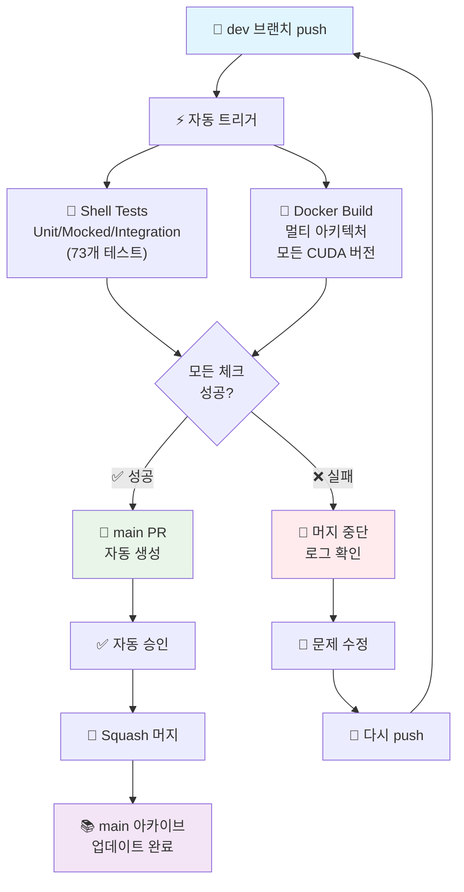

# 🐳 Personal RunPod Development Environment

> **완전히 새로워진 프로젝트 구조!** ✨  
> 컨테이너 빌드용 파일과 개발 도구가 명확히 분리되었습니다.

## 🎯 빠른 시작

### 🚀 Just 명령 실행기 사용 (권장)
```bash
# Just 설치 (uv 패키지 관리자)
uv add --dev rust-just

# 1. 개발 환경 전체 설정
just dev-setup

# 2. CPU 버전 빌드 (가장 자주 사용)
just cpu

# 3. 모든 명령어 보기
just
```

### 🔧 수동 실행 (Just 없이)
```bash
# 1. 개발 환경 체크
./dev-tools/check-dev-requirements.sh

# 2. 빌드 설정 확인
./dev-tools/simple-version-test.sh

# 3. 컨테이너 빌드
docker buildx bake cpu
```

## 📁 프로젝트 구조

```
personal-runpod-image/
├── 🐳 container/          # 컨테이너 빌드 전용
├── 🔧 dev-tools/         # 개발 및 관리 도구  
├── 📚 docs/              # 모든 문서 및 가이드
└── [빌드 설정 파일들]
```

## 📚 주요 문서

| 문서 | 설명 |
|------|------|
| [📖 **전체 가이드**](docs/README.md) | 상세한 프로젝트 문서 |
| [🚀 **Just 사용법**](docs/guides/just-usage.md) | Just 명령 실행기 가이드 |
| [🔧 **개발 가이드**](docs/guides/development.md) | 개발 환경 설정 |
| [🤖 **PR 자동 머지**](docs/guides/pr-auto-merge.md) | 자동 머지 시스템 가이드 |
| [⚙️ **도구 관리**](docs/guides/tool-management.md) | 버전 관리 및 도구 분류 |
| [🧪 **Shell 테스트**](docs/shell-testing.md) | Shell 테스트 시스템 |
| [📋 **요구사항**](docs/guides/dev-requirements.md) | 개발 환경 요구사항 |

## 🤖 **자동 빌드 & 머지 시스템**

> **✨ 새로운 dev 브랜치 중심 CI/CD**: dev에서 개발 → 자동 테스트/빌드 → main 자동 머지!

### 🔄 **완전 자동화 워크플로우**



### 📋 **자동화 조건**
- ✅ **dev 브랜치 push** → 즉시 빌드 및 테스트 시작  
- ✅ **🧪 Shell 테스트 통과** (73개 테스트 케이스)
- ✅ **🐳 Docker 빌드 성공** (모든 아키텍처)
- ✅ **자동 main 머지** → 📚 안정된 아카이브 유지

```bash
# 🚀 이제 이것만 하면 모든 게 자동화됩니다!
git checkout dev
git add .
git commit -m "feat: 새로운 기능"
git push origin dev
# → 자동 테스트 → 자동 빌드 → 자동 main 머지 🎉
```

## 🚀 개발 워크플로우

### 🎯 Just 명령어 (권장)
```bash
# 🔍 환경 체크
just check-env
just check-versions

# 🔧 버전 관리
just update-versions

# 🐳 빌드 및 실행
just cpu                    # CPU 버전 빌드
just cuda                   # CUDA 최신 버전 빌드
just build-target 12-6-2    # 특정 CUDA 버전 빌드

# 🧪 테스트
just test                   # 빠른 테스트
just test-all              # 전체 테스트
just ci                    # CI 파이프라인 시뮬레이션

# 📊 상태 확인
just status                # 프로젝트 상태
just info                  # 상세 정보
```

### 🔧 수동 명령어 (Just 없이)
```bash
# 🔍 환경 체크
./dev-tools/check-dev-requirements.sh
./dev-tools/simple-version-test.sh

# 🔧 버전 관리
python3 dev-tools/update-container-versions.py

# 🐳 빌드 및 실행
docker buildx bake cpu      # CPU 버전 빌드
docker buildx bake 12-6-2   # CUDA 12.6.2 버전 빌드

# 🧪 테스트
./run_shell_tests.sh --unit-only
```

## 📞 문의 및 지원

- **📖 문서**: [docs/](docs/) 디렉토리 참조
- **🔧 개발 도구**: [dev-tools/](dev-tools/) 디렉토리 참조
- **🐳 컨테이너**: [container/](container/) 디렉토리 참조

---

> **이전 README**: [docs/README.md](docs/README.md)에서 전체 내용 확인 가능 