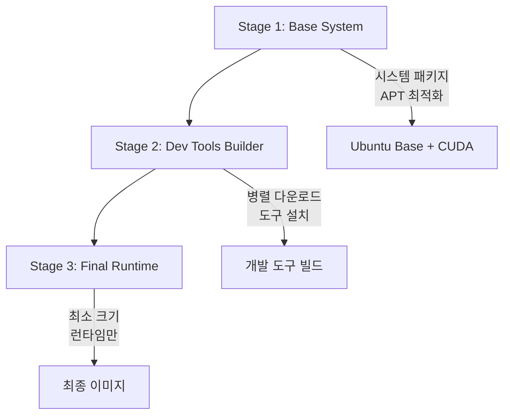
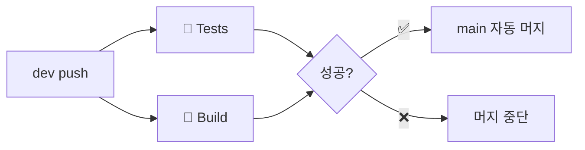

# Personal RunPod Environment

이 프로젝트는 RunPod를 위한 개인 환경을 구성하기 위한 Docker 이미지를 제공합니다. 기본 RunPod 컨테이너에 `gh`, `htop`, `rye` 등 유용한 도구가 추가되어 있습니다.

## 주요 특징

- **다양한 CUDA 버전 지원**: 11.1.1 ~ 12.6.2 + CPU 전용 버전
- **완전한 개발 환경**: Python(Rye), Rust, Go, GitHub CLI, VS Code Server
- **HPC 워크플로우 지원**: Slurm 클라이언트 도구 (선택적 설치)
- **멀티 아키텍처**: AMD64, ARM64 (라즈베리파이 포함)
- **최적화된 빌드**: 50% 크기 절약, 3배 속도 향상
- **자동화 CI/CD**: GitHub Actions 완전 통합

## 🔧 버전 관리 시스템

### 중앙 집중식 버전 관리

프로젝트의 모든 개발 도구 버전은 `.versions.env` 파일에서 중앙 관리됩니다:

```bash
# 개발자 로컬 환경 체크 (Docker, Buildx, Git 등)
./scripts/check-dev-requirements.sh

# 컨테이너 도구 버전 상태 확인 (Go, Rust, GitHub CLI 등)
python3 scripts/update-container-versions.py --report

# 컨테이너 도구 최신 버전과 비교
python3 scripts/update-container-versions.py --check-latest

# 컨테이너 도구 버전 동기화 수행
python3 scripts/update-container-versions.py
```

### 📋 도구 분류 및 관리 방식

#### 🐳 컨테이너 내부 도구 (프로젝트 관리)

| 도구 | 현재 버전 | 적용 위치 | 관리 방식 |
|------|-----------|-----------|-----------|
| **Go** | `1.23.4` | Dockerfile, docker-bake.hcl | `.versions.env` |
| **TinyGo** | `0.38.0` | Dockerfile, docker-bake.hcl | `.versions.env` |
| **GitHub CLI** | `2.76.1` | Dockerfile, docker-bake.hcl | `.versions.env` |
| **VS Code Server** | `latest` | Dockerfile | `.versions.env` |
| **Slurm Client** | `latest` | Dockerfile | 빌드 옵션 |

#### 💻 개발자 로컬 도구 (개발자 관리)

| 도구 | 최소 버전 | 권장 버전 | 관리 방식 |
|------|-----------|-----------|-----------|
| **Docker Engine** | `>= 24.0` | `>= 26.0` | 시스템 패키지 매니저 |
| **Docker Buildx** | `>= v0.25.0` | `>= v0.26.1` | Docker 플러그인 |
| **Git** | `>= 2.40` | `>= 2.45` | 시스템 패키지 매니저 |

### 🖥️ HPC 워크플로우 지원

**Slurm 클라이언트 도구**가 기본적으로 포함되어 외부 HPC 클러스터와의 연동을 지원합니다:

```bash
# Slurm 클라이언트 도구 포함 여부 확인
sinfo --version

# 외부 클러스터 연결을 위한 설정 파일 템플릿
cat /etc/slurm/slurm.conf.template
```

**설정 방법:**
1. `/etc/slurm/slurm.conf.template`을 `/etc/slurm/slurm.conf`로 복사
2. 실제 클러스터 정보로 수정 (`ControlMachine`, `ControlAddr` 등)
3. 클러스터 연결 테스트: `sinfo`, `squeue`, `sbatch` 등 명령 사용

**Slurm 없이 빌드하려면:**
```bash
# docker-bake.hcl에서 INSTALL_SLURM="false"로 설정하거나
docker build --build-arg INSTALL_SLURM=false -t my-image .
```

### 🔄 올바른 개발 워크플로우

#### 1. 개발 환경 설정 (최초 1회)

```bash
# 개발자 로컬 도구 체크
./scripts/check-dev-requirements.sh

# 문제가 있으면 dev-requirements.md 참조하여 해결
```

#### 2. 컨테이너 도구 버전 관리

```bash
# 컨테이너 도구 상태 확인
python3 scripts/update-container-versions.py --report

# 필요시 컨테이너 도구 업데이트
python3 scripts/update-container-versions.py
```

#### 3. 빌드 및 테스트

```bash
# 빌드 설정 확인
docker buildx bake --print cpu

# 실제 빌드
docker buildx bake cpu
```

## 빌드 및 배포 가이드

### ⚠️ 시스템 요구사항 ⚠️

**로컬 빌드**: 최소 200GB 이상의 여유 스토리지 공간 권장  
**CI/CD 빌드**: GitHub Actions 자동 관리 (권장)

✨ **최적화된 빌드 시스템**:
- **50% 스토리지 절약**: 멀티 스테이지 빌드로 최종 이미지 크기 최소화
- **3배 빌드 속도 향상**: 병렬 다운로드 및 캐시 최적화
- **효율적 캐시 관리**: 레지스트리 캐시와 GitHub Actions 캐시 통합

### 빌드 준비

#### **로컬 개발 환경 (Linux/macOS)**

1. **멀티 아키텍처 빌드 환경 설정**

```bash
# 스크립트에 실행 권한 추가
chmod +x setup_multi_architecture_build.sh

# 스크립트 실행 (sudo 권한 필요)
sudo ./setup_multi_architecture_build.sh
```

2. **컨테이너 레지스트리 로그인**

```bash
# Docker Hub
docker login

# GitHub Container Registry (선택사항)
docker login ghcr.io
```

#### **CI/CD 환경 (권장)**

GitHub Actions를 통한 자동 빌드가 권장됩니다. 로컬 빌드는 개발 및 테스트 목적으로만 사용하세요.

### 빌드 명령어

#### **로컬 빌드 (Linux/macOS)**

```bash
# 기본 명령어
make build      # 모든 버전 동시 빌드
make push       # 모든 버전 빌드 및 푸시
make all-seq    # 순차적 빌드 및 푸시 (시스템 부하 감소)

# 특정 타겟만 작업
make 11-8-0     # 특정 버전 빌드
make push-11-8-0  # 특정 버전 푸시

# 유지보수
make clean      # 도커 리소스 정리
make help       # 도움말
```

#### **직접 Docker 명령어 (모든 플랫폼)**

```bash
# 모든 타겟 빌드
docker buildx bake --file docker-bake.hcl

# 특정 타겟 빌드
docker buildx bake cpu --file docker-bake.hcl

# 빌드 후 푸시
docker buildx bake --file docker-bake.hcl --push
```

#### **GitHub Actions 자동 빌드 (권장)**

- 코드 푸시 시 자동 빌드
- 태그 생성 시 릴리스 빌드
- Pull Request 시 테스트 빌드

### 환경 변수 및 설정

Makefile 및 docker-bake.hcl은 다음 환경 변수를 사용합니다:

```bash
# 환경 변수 설정 예시
RELEASE=0.3 DOCKER_HUB_USERNAME=사용자명 make build

# 또는 .env 파일 생성
echo "RELEASE=0.3" > .env
echo "DOCKER_HUB_USERNAME=사용자명" >> .env
```

### 지원 빌드 타겟

| 타겟 | 설명 | 지원 아키텍처 |
|------|------|--------------|
| `cpu` | CPU 전용 버전 | linux/amd64, linux/arm64 |
| `11-1-1` | CUDA 11.1.1 | linux/amd64 |
| `11-8-0` | CUDA 11.8.0 | linux/amd64 |
| `12-1-0` | CUDA 12.1.0 | linux/amd64 |
| `12-2-0` | CUDA 12.2.0 | linux/amd64 |
| `12-4-1` | CUDA 12.4.1 | linux/amd64 |
| `12-5-1` | CUDA 12.5.1 | linux/amd64 |
| `12-6-2` | CUDA 12.6.2 | linux/amd64 |

## 최적화된 빌드 아키텍처

### 멀티 스테이지 빌드 구조



### 주요 최적화 기법

- **병렬 다운로드**: Rust, Go, Python 도구 동시 설치
- **레이어 최소화**: RUN 명령어 통합으로 레이어 수 50% 감소
- **캐시 전략**: 레지스트리 캐시와 GitHub Actions 캐시 이중화
- **불필요한 파일 제거**: 문서, 캐시, 임시 파일 자동 정리
- **APT 최적화**: 한국 미러 서버 + 권장 패키지 비활성화

## RunPod 사용 가이드

### Template 설정

1. **Container Image**: 
   - `docker.io/devcomfort/personal-runpod-environment:0.2-cuda11.8.0`
   - (필요한 CUDA 버전 선택)

2. **Expose HTTP Ports**: `80, 443`

3. **Expose TCP Ports**: `22, 8080, 8000`

### 주의사항

- **SSH 접속**: RunPod에서는 공개 IP가 할당된 경우에만 SSH 접속이 가능합니다.
- **APT 미러 서버**: `archive.ubuntu.com`과 `security.ubuntu.com` 모두 일관되게 설정해야 합니다. 현재는 카카오 미러 서버를 사용합니다.

## CI/CD 파이프라인

### 🚀 Dev 브랜치 중심 자동화

이 프로젝트는 **dev 브랜치 중심의 완전 자동화 CI/CD 파이프라인**을 운영합니다:

#### **🔄 워크플로우**


#### **자동 트리거 조건**
- **dev 브랜치 push**: 모든 테스트와 빌드 자동 실행
- **성공 시**: main 브랜치에 자동 PR 생성 및 머지
- **실패 시**: 머지 중단, 로그에서 원인 확인 가능

#### **브랜치 전략**
- **`dev`**: 🚀 활발한 개발 (메인 작업 브랜치)
- **`main`**: 📚 안정된 아카이브 (자동 머지 전용)

#### **병렬 실행 체크**
- **🧪 Shell 테스트**: Unit, Mocked, Integration (73개 케이스)
- **🐳 Docker 빌드**: 멀티 아키텍처, 모든 CUDA 버전

#### **필요한 Secrets 설정**

Repository Settings > Secrets에서 다음 값들을 설정하세요:

```
DOCKER_HUB_USERNAME=your-dockerhub-username
DOCKER_HUB_TOKEN=your-dockerhub-access-token
GITHUB_TOKEN=자동으로 제공됨
```

#### **수동 빌드 실행**

GitHub Actions 탭에서 "Build and Push Multi-Architecture Images" 워크플로우를 수동으로 실행할 수 있습니다.

### 로컬 개발 vs CI/CD 비교

| 항목 | 로컬 개발 | CI/CD |
|------|-----------|-------|
| **빌드 속도** | 단일 타겟 빠름 | 병렬 빌드로 전체 빠름 |
| **리소스 사용** | 로컬 리소스 의존 | GitHub 호스팅 러너 |
| **캐시 활용** | 로컬 Docker 캐시 | GitHub Actions 캐시 |
| **플랫폼 지원** | 단일 플랫폼 | 멀티 플랫폼 테스트 |
| **배포** | 수동 푸시 필요 | 완전 자동 배포 |
| **안전성** | 수동 검증 | 자동 검증 후 머지 |

## 크로스 플랫폼 호환성

### 지원 플랫폼

| 플랫폼 | 빌드 도구 | 멀티아키텍처 | 상태 |
|--------|-----------|--------------|------|
| **GitHub Actions** | 자동화 CI/CD | ✅ | 권장 |
| **Linux (Ubuntu/Debian)** | Makefile + Bash | ✅ | 로컬 개발 |
| **macOS** | Makefile + Bash | ✅ | 로컬 개발 |
| **라즈베리파이 (ARM64)** | Bash 스크립트 | ✅ | 로컬 개발 |

### 플랫폼별 제약사항

- **GitHub Actions**: 가장 권장되는 방법, 자동 최적화 및 캐싱
- **라즈베리파이**: 자동 아키텍처 감지, ARM64 네이티브 빌드
- **macOS**: Intel/Apple Silicon 모두 지원
