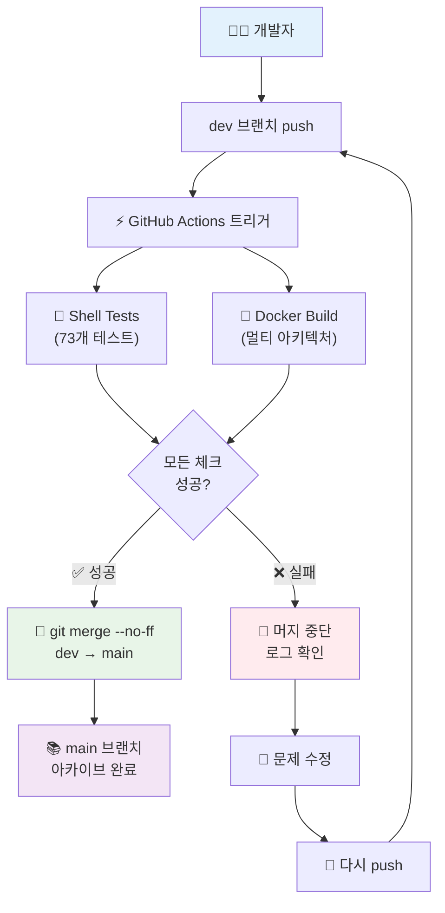

# 🚀 No PR 직접 머지 CI/CD 시스템 완벽 가이드

## 📋 시스템 개요

이 프로젝트는 **개인 작업에 최적화된 초단순 CI/CD 파이프라인**을 운영합니다. PR 단계를 완전히 제거하여 불필요한 오버헤드를 줄이고, 더 빠르고 효율적인 개발 워크플로우를 제공합니다.

### 🎯 핵심 특징

- **🚫 No PR**: Pull Request 단계 완전 제거
- **⚡ 빠른 배포**: 테스트 통과 즉시 main 브랜치 반영
- **🤖 완전 자동화**: 개발자는 dev에 push만 하면 됨
- **🛡️ 안전성 확보**: 모든 체크 통과 시에만 머지

## 🔄 워크플로우 아키텍처



## 📊 시스템 구성 요소

### 🔧 GitHub Actions 워크플로우

| 워크플로우 | 파일 | 역할 | 트리거 |
|-----------|------|------|--------|
| **Build and Push** | `build-and-push.yml` | Docker 빌드 & 테스트 | dev push |
| **Shell Tests** | `shell-tests.yml` | Shell 스크립트 테스트 | dev push |
| **Direct Merge** | `dev-to-main-direct-merge.yml` | 성공 시 직접 머지 | 위 두 워크플로우 성공 |

### 🌿 브랜치 전략

```bash
# 🎯 극단적으로 단순화된 브랜치 구조
main    # 📚 안정된 아카이브 (자동 머지 전용, 읽기 전용)
dev     # 🚀 활발한 개발 (메인 작업 브랜치, 개발자 활동)

# 필요시 사용
feature/*  # dev에서 분기 → dev로 머지
bugfix/*   # dev에서 분기 → dev로 머지
```

## 🛠️ 개발자 워크플로우

### 📅 일상적인 개발 과정

```bash
# 🌅 아침: 최신 상태로 동기화
git checkout dev
git pull origin dev

# 💻 개발: 기능 구현 및 로컬 테스트
just dev-setup      # 개발 환경 설정
just test           # 로컬 테스트 실행
just cpu            # 로컬 빌드 테스트

# ✅ 완료: 커밋 및 푸시 (모든 자동화 시작!)
git add .
git commit -m "feat: 새로운 기능 구현"
git push origin dev  # 🚀 이 순간 모든 것이 자동으로!

# 📊 모니터링: GitHub Actions에서 진행 상황 확인
# https://github.com/your-repo/actions
```

### 🔄 자동화 프로세스

#### ✅ **성공 시나리오**
```bash
1. dev push 완료
2. 🧪 Shell Tests 실행 (73개 케이스) → ✅ 통과
3. 🐳 Docker Build 실행 (멀티 아키텍처) → ✅ 성공
4. 🚀 자동으로 main에 git merge --no-ff
5. 📚 main 브랜치 아카이브 업데이트 완료
6. 🎉 완료! (약 5-8분 소요)
```

#### ❌ **실패 시나리오**
```bash
1. dev push 완료
2. 🧪 Shell Tests 또는 🐳 Docker Build 실패
3. 🚫 main 머지 중단
4. 📝 GitHub Actions 로그에서 실패 원인 확인
5. 🔧 로컬에서 문제 수정
6. 📝 다시 push → 자동 재시도
```

## 🎯 시스템 장점

### 💨 **속도 개선**

| 단계 | 기존 PR 방식 | No PR 직접 머지 | 시간 절약 |
|------|-------------|----------------|-----------|
| 개발 완료 | dev push | dev push | - |
| 검증 | 테스트 + 빌드 | 테스트 + 빌드 | - |
| PR 생성 | 수동 생성 | ❌ 생략 | **2분** |
| PR 승인 | 수동 승인 | ❌ 생략 | **3분** |
| 머지 실행 | 수동 클릭 | 자동 실행 | **1분** |
| **총 시간** | **약 10-15분** | **약 5-8분** | **40-50% 단축** |

### 🎯 **복잡성 제거**

```bash
# ❌ 기존 복잡한 과정
git push origin feature-branch
# → GitHub에서 PR 생성
# → 테스트 결과 대기
# → 수동 승인
# → 머지 클릭
# → 브랜치 삭제

# ✅ 새로운 단순한 과정
git push origin dev
# → 모든 것이 자동으로 완료! 🎉
```

### 🚀 **개인 프로젝트 최적화**

- **코드 리뷰 불필요**: 개인 프로젝트에서 self-review는 비효율적
- **승인 단계 제거**: 혼자 작업할 때 승인은 형식적 절차
- **브랜치 관리 단순화**: 복잡한 브랜치 전략 불필요
- **즉시 배포**: 아이디어 → 구현 → 배포까지 최단 시간

## 🛡️ 안전성 보장

### 🔍 **엄격한 자동 검증**

```yaml
필수 통과 조건:
  🧪 Shell Tests:
    - Unit Tests (단위 테스트)
    - Mocked Tests (모킹 테스트)  
    - Integration Tests (통합 테스트)
    - 총 73개 테스트 케이스
    
  🐳 Docker Build:
    - CPU 아키텍처 빌드
    - CUDA 11.1.1, 11.8.0, 12.x.x 빌드
    - linux/amd64, linux/arm64 멀티 아키텍처
    - 모든 타겟 성공 필수
```

### 🚫 **실패 시 보호**

- **Zero Tolerance**: 하나라도 실패하면 머지 중단
- **명확한 로그**: 실패 원인 상세 출력
- **안전한 롤백**: main 브랜치에 영향 없음
- **재시도 자동화**: 수정 후 push하면 자동 재검증

## ⚙️ 설정 및 커스터마이징

### 🔧 **필수 설정**

#### GitHub Secrets
```bash
Repository > Settings > Secrets and variables > Actions

Required:
  DOCKER_HUB_USERNAME    # Docker Hub 사용자명
  DOCKER_HUB_TOKEN       # Docker Hub 액세스 토큰
  
Auto-provided:
  GITHUB_TOKEN           # GitHub에서 자동 제공
```

#### Branch Protection (선택사항)
```bash
# main 브랜치 보호 (권장)
Repository > Settings > Branches > Add rule

Branch name pattern: main
Restrictions:
  ✅ Restrict pushes that create files larger than 100MB
  ❌ Require pull request reviews (No PR 시스템이므로 불필요)
  ❌ Require status checks (자동 머지가 이미 검증함)
```

### 🎛️ **커스터마이징 옵션**

#### 테스트 추가
```yaml
# .github/workflows/dev-to-main-direct-merge.yml에서
REQUIRED_WORKFLOWS=("🐳 Build and Push Multi-Architecture Images" "🧪 Shell Tests" "새로운 워크플로우")
```

#### 조건 수정
```yaml
# 특정 조건에서만 머지
if: |
  github.event.workflow_run.conclusion == 'success' &&
  github.event.workflow_run.head_branch == 'dev' &&
  !contains(github.event.head_commit.message, '[skip-merge]')
```

## 🚨 문제 해결

### 📊 **모니터링 도구**

```bash
# GitHub Actions 상태 확인
https://github.com/your-repo/actions

# GitHub CLI 사용
gh run list --branch dev
gh run view <run-id> --log

# 실패한 워크플로우 재실행
gh run rerun <run-id>
```

### 🔧 **일반적인 문제들**

#### 1. Shell Tests 실패
```bash
# 로컬에서 재현
just test-all              # 전체 테스트
just test-unit             # 단위 테스트만
just test-integration      # 통합 테스트만

# 특정 테스트 디버깅
./run_shell_tests.sh --verbose
```

#### 2. Docker Build 실패
```bash
# 로컬에서 빌드 테스트
just cpu                   # CPU 버전 빌드
just check-env             # 환경 설정 확인

# 버전 일관성 확인
./dev-tools/simple-version-test.sh
```

#### 3. Git Merge 충돌
```bash
# 수동 해결 (자동 해결 불가능한 경우)
git checkout main
git pull origin main
git checkout dev
git rebase main             # 충돌 해결
git push origin dev --force-with-lease
```

#### 4. 긴급 수동 머지
```bash
# CI/CD 우회하여 직접 머지 (비상시만)
git checkout main
git pull origin main
git merge dev --no-ff -m "Emergency merge"
git push origin main
```

## 🎯 적용 가이드라인

### ✅ **이 시스템이 적합한 경우**

- 👤 **개인 프로젝트**
- 👥 **소규모 팀** (1-3명)
- 🚀 **빠른 프로토타이핑**
- 🧪 **자동화된 테스트가 충분한 경우**
- ⚡ **빠른 피드백이 중요한 경우**

### ❌ **이 시스템이 부적합한 경우**

- 🏢 **대규모 팀 프로젝트**
- 👁️ **코드 리뷰가 필수인 환경**
- 📋 **규제가 많은 산업** (금융, 의료 등)
- 🔒 **엄격한 승인 프로세스가 필요한 경우**
- 📝 **문서화 및 추적이 중요한 경우**

## 🔮 향후 개선 계획

### 📅 **단기 계획** (1-2개월)

- [ ] `[skip-ci]` 커밋 메시지 태그 지원
- [ ] 실패 시 Slack/Discord 알림 통합
- [ ] 더 상세한 빌드 성능 리포트
- [ ] main 브랜치 보호 규칙 추가 (optional)

### 🎯 **장기 계획** (3-6개월)

- [ ] 스테이징 환경 자동 배포
- [ ] 자동 백업 및 롤백 시스템
- [ ] 릴리즈 태그 자동 생성
- [ ] 성능 벤치마크 자동 실행
- [ ] 보안 취약점 자동 스캔

---

## 📝 요약

**No PR 직접 머지 CI/CD 시스템**은 개인 프로젝트의 효율성을 극대화하는 혁신적인 접근법입니다:

1. **dev 브랜치에서 개발** → 2. **자동 테스트/빌드** → 3. **직접 main 머지**

복잡한 PR 프로세스를 제거하여 **40-50% 빠른 배포**와 **극단적인 단순화**를 달성했습니다. 개인 작업에서는 **단순함이 최고의 복잡함을 이깁니다**! 🚀 