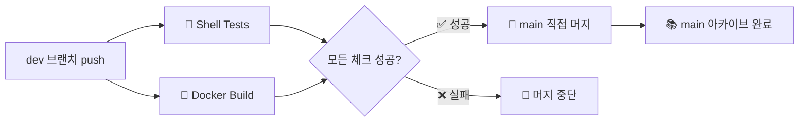

# 🚀 Dev 브랜치 자동 빌드 & Main 직접 머지 시스템

## 📋 개요

이 프로젝트는 **dev 브랜치 중심의 초단순 CI/CD 파이프라인**을 도입했습니다. dev 브랜치에서 모든 개발이 진행되고, 빌드와 테스트가 성공하면 **PR 없이 직접 main 브랜치에 머지**됩니다.

> **🎯 핵심 철학**: `dev` = 활발한 개발, `main` = 안정된 아카이브, **No PR** = 개인 프로젝트 최적화

## 🔄 초단순 자동화 워크플로우

### **🚀 Dev 브랜치 워크플로우**



### **트리거 조건**
- ✅ **dev 브랜치 push**: 즉시 빌드 및 테스트 시작
- ✅ **모든 체크 성공**: 자동으로 main 브랜치에 직접 머지

### **필수 체크 항목**
1. **🧪 Shell 테스트**: Unit, Mocked, Integration 테스트 (73개)
2. **🐳 Docker 빌드**: 멀티 아키텍처 빌드 성공

## 🎯 완전 자동화 프로세스

### **1단계: dev 브랜치 개발** 
```bash
# 일상적인 개발 워크플로우
git checkout dev
git add .
git commit -m "feat: 새로운 기능 추가"
git push origin dev
# 🚀 이제 모든 것이 자동으로 시작됩니다!
```

### **2단계: 자동 빌드 & 테스트**
```yaml
⚡ 즉시 실행 (병렬):
  🧪 Shell Tests (Unit/Mocked/Integration)
  🐳 Docker Build (모든 타겟, 멀티 아키텍처)
```

### **3단계: 성공 시 직접 main 머지**
```yaml
✅ 모든 체크 통과 시:
  🚀 main 브랜치로 직접 git merge
  📚 main 브랜치 아카이브 업데이트
  🚫 No PR - 개인 프로젝트 최적화
```

## 📊 워크플로우 상세

### **🔍 필수 체크 요구사항**

| 워크플로우 | 실행 조건 | 필수 여부 | 실패 시 처리 |
|-----------|-----------|----------|------------|
| 🧪 **Shell Tests** | dev push | ✅ 필수 | 머지 중단 |
| 🐳 **Build and Push** | dev push | ✅ 필수 | 머지 중단 |

### **🚀 자동 처리 프로세스**

#### **✅ 성공적인 자동 머지 흐름**
```bash
# dev 브랜치에서 개발
git push origin dev

# 자동 실행
✅ Shell 테스트 통과 (73개 케이스)
✅ Docker 빌드 성공 (CPU/CUDA 모든 타겟)

# 직접 main 머지
🚀 main 브랜치로 git merge --no-ff
📚 main 브랜치 업데이트 완료

# 결과
🎉 코드가 안전하게 main에 아카이브됨! (No PR)
```

#### **❌ 실패 시 처리**
```bash
# dev 브랜치에서 push
git push origin dev

# 일부 체크 실패
❌ Shell 테스트 실패 또는
❌ Docker 빌드 실패

# 결과
🚫 main 머지 하지 않음
📝 GitHub Actions에서 실패 로그 확인 가능
🔧 문제 수정 후 다시 push하면 재시도
```

## 🛠️ 개발자 워크플로우

### **일상적인 개발 과정**

```bash
# 1. dev 브랜치에서 개발
git checkout dev
git pull origin dev  # 최신 상태로 동기화

# 2. 기능 개발 및 로컬 테스트
just dev-setup      # 개발 환경 설정
just test           # 로컬 테스트 실행
just cpu            # 로컬 빌드 테스트

# 3. 커밋 및 푸시 (자동화 시작점)
git add .
git commit -m "feat: 새로운 기능 구현"
git push origin dev  # 🚀 여기서 모든 자동화 시작!

# 4. 결과 확인
# GitHub Actions에서 진행 상황 모니터링
# 성공 시: main 브랜치에 직접 머지됨 ✅
# 실패 시: 로그 확인 후 수정 🔧
```

### **브랜치 전략**

#### **🔄 극단적으로 단순화된 Git 플로우**
```bash
# 주요 브랜치
main    # 📚 안정된 아카이브 (자동 머지 전용)
dev     # 🚀 활발한 개발 (메인 작업 브랜치)

# 개발 브랜치 (필요시)
feature/new-feature  # dev에서 분기 → dev로 머지
bugfix/critical-fix  # dev에서 분기 → dev로 머지
```

#### **⚠️ 중요한 변경사항**
```bash
# ❌ 기존 복잡한 방식
git checkout -b feature/branch
# PR 생성 → 승인 → 머지

# ✅ 새로운 초단순 방식
git checkout dev
# push → 자동 테스트 → 직접 main 머지 (No PR!)
```

## 📈 장점 및 개선사항

### **✅ 초단순 시스템의 장점**

| 항목 | 기존 PR 방식 | 새로운 직접 머지 | 개선 효과 |
|------|-------------|----------------|-----------|
| **머지 프로세스** | PR 생성/승인/머지 | 직접 git merge | ⚡ 더 빠른 배포 |
| **복잡성** | PR 관리 필요 | 완전 자동화 | 🎯 극단적 단순화 |
| **개인 프로젝트** | 불필요한 오버헤드 | 최적화된 워크플로우 | 🚀 개인 작업 특화 |
| **속도** | PR 단계 대기 | 즉시 머지 | ⚡ 빠른 피드백 |

### **🔧 개발자 경험 극대화**
- **초단순 워크플로우**: dev 브랜치에서만 작업
- **즉시 피드백**: push 후 바로 테스트 결과 확인
- **No PR 오버헤드**: 개인 프로젝트에 최적화
- **안전한 개발**: 실패 시 main에 영향 없음

## ⚙️ 고급 설정 및 커스터마이징

### **워크플로우 모니터링**

```bash
# GitHub Actions 상태 확인
https://github.com/your-repo/actions

# 실시간 로그 확인
gh run list --branch dev
gh run view <run-id> --log
```

### **긴급 상황 대응**

#### **수동 main 머지** (비상시)
```bash
# 직접 Git 명령 사용
git checkout main
git pull origin main
git merge dev --no-ff
git push origin main
```

#### **자동 머지 일시 중지**
- 현재는 dev 브랜치 push를 중단하는 것이 유일한 방법
- 향후 `[skip-ci]` 태그 지원 예정

### **디버깅 및 문제 해결**

#### **일반적인 실패 시나리오**

```bash
# 1. Shell 테스트 실패
just test-all              # 로컬에서 재현
just test-unit             # 단위 테스트만
just test-integration      # 통합 테스트만

# 2. Docker 빌드 실패
just check-env             # 환경 설정 확인
just cpu                   # 로컬 빌드 테스트
./dev-tools/simple-version-test.sh  # 버전 일관성 확인

# 3. Git 머지 충돌
# 자동 해결 안됨 - 수동으로 dev 브랜치 정리 필요
```

## 🎯 개인 프로젝트 최적화

### **왜 No PR인가?**
- **🏃‍♂️ 속도**: PR 생성/승인 단계 제거로 더 빠른 배포
- **🎯 단순성**: 개인 프로젝트에서 PR 검토는 불필요
- **⚡ 효율성**: 모든 체크가 자동화되어 있어 안전성 확보
- **🛠️ 실용성**: 복잡한 워크플로우보다 실제 개발에 집중

### **언제 이 방식을 사용하면 좋을까?**
```bash
✅ 개인 프로젝트
✅ 소규모 팀 (1-3명)
✅ 빠른 프로토타이핑
✅ 자동화된 테스트가 충분한 경우

❌ 대규모 팀 프로젝트
❌ 코드 리뷰가 필수인 경우
❌ 규제가 많은 환경
```

## 🎯 향후 개선 계획

### **단기 계획** (1-2개월)
- [ ] `[skip-ci]` 커밋 메시지 태그 지원
- [ ] 실패 시 Slack/Discord 알림
- [ ] main 브랜치 보호 규칙 추가 (optional)

### **장기 계획** (3-6개월)
- [ ] 스테이징 환경 자동 배포
- [ ] 자동 백업 및 롤백 시스템
- [ ] 릴리즈 태그 자동 생성

---

## 🚀 결론

**No PR, 직접 머지** 방식으로 개발 프로세스가 극단적으로 단순화되었습니다:

1. **dev에서 개발** → 2. **자동 테스트/빌드** → 3. **직접 main 머지**

개인 프로젝트에서는 PR이 불필요한 오버헤드일 수 있습니다. 이제 **dev 브랜치에서만 작업하고 push**하면 모든 것이 자동화되어 **더 빠르고 효율적인 개발**이 가능합니다! 🎉 